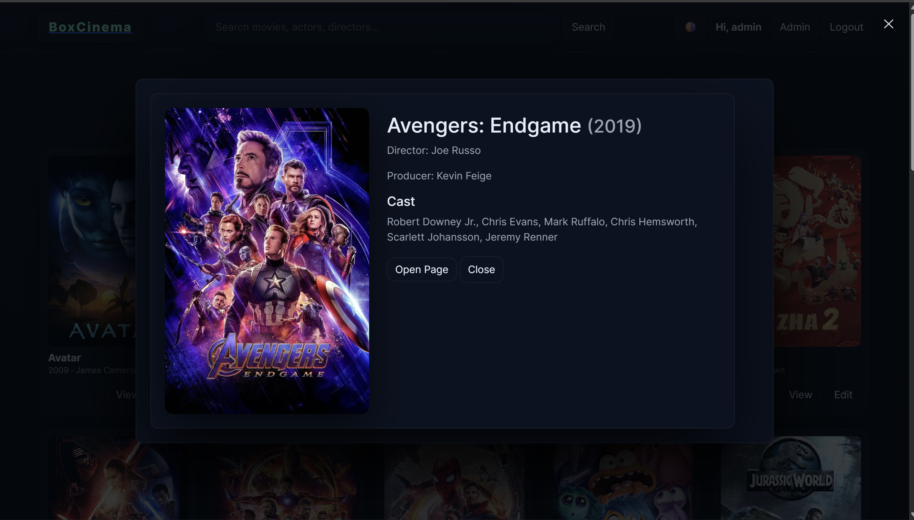
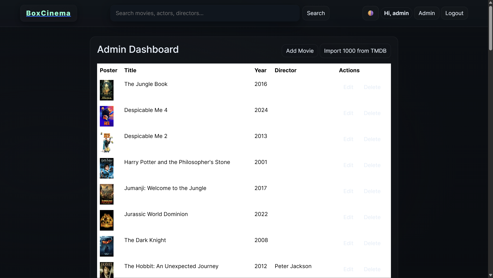

# 🎬 Movie Portal Website

A visually stunning and dynamic **Movie Portal Website** inspired by Netflix and Apple’s glassmorphism design — built using **HTML, CSS, JavaScript (Vanilla)** for the frontend and **Flask + SQLite + TMDB API** for the backend.

---

## 🚀 Features

- 🎞️ **Dynamic Movie Feed:** Displays top 1000 highest-grossing movies from TMDB API.
- 🌗 **Dark/Light Mode:** Toggle between themes with smooth glassmorphism effect.
- 🔍 **Search Functionality:** Instantly search and filter movies without page reload.
- 🎥 **Movie Popups:** Click on any movie card to see detailed information.
- 👤 **User Authentication:** Login, Register, and Admin access pages.
- ⚙️ **Admin Dashboard:** Import movies, manage users, and monitor site data.
- 💾 **SQLite Database:** Stores user and movie data securely.
- 🧠 **Backend Integration:** Flask with Jinja2 for seamless frontend-backend data rendering.
- 📱 **Responsive Design:** Built with Tailwind + Bootstrap for all devices.

---

## 🏗️ Tech Stack

### **Frontend**
- HTML5 — Page structure
- CSS3 / Tailwind / Bootstrap — Styling & Responsiveness
- Vanilla JavaScript — Interactivity & Dynamic Data
- Jinja2 Templates — Frontend data binding

### **Backend**
- Flask (Python) — Web framework
- Flask-SQLAlchemy — ORM for database
- SQLite — Lightweight relational database
- TMDB API — Movie data source
- Flask-Bcrypt, Flask-Login — Authentication

---

## 📂 Folder Structure

```
movie-portal/
│
├── static/
│   ├── css/
│   │   └── style.css
│   ├── js/
│   │   └── main.js
│   └── images/
│       └── default_poster.png
│
├── templates/
│   ├── index.html
│   ├── login.html
│   ├── register.html
│   ├── admin.html
│   ├── add_movie.html
│   └── movie_details.html
│
├── app.py
├── requirements.txt
├── Procfile
├── .env
└── README.md
```

---

## ⚙️ Installation Guide

### 1️⃣ Clone this Repository
```bash
git clone https://github.com/your-username/movie-portal-flask.git
cd movie-portal-flask
```

### 2️⃣ Create Virtual Environment
```bash
python -m venv venv
venv\Scripts\activate     # for Windows
source venv/bin/activate   # for Mac/Linux
```

### 3️⃣ Install Dependencies
```bash
pip install -r requirements.txt
```

### 4️⃣ Setup Environment Variables
Create a `.env` file in the root folder:
```
TMDB_API_KEY=your_tmdb_api_key_here
```

### 5️⃣ Run the App
```bash
python app.py
```
Then visit 👉 [http://127.0.0.1:5000](http://127.0.0.1:5000)

---

## 🌍 Deployment

### On **Render**
1. Push project to GitHub.
2. Create new **Web Service** on Render.
3. Build Command → `pip install -r requirements.txt`
4. Start Command → `gunicorn app:app`
5. Add your TMDB_API_KEY in Render Environment Variables.

After deployment, you’ll get your live URL like:
```
https://movie-portal.onrender.com
```

---

## 📸 Screenshots

| Home Page | Movie Info | Admin Dashboard |
|------------|-------------|----------------|
|  |  |  |

---

## 👨‍💻 Contributors

- **Frontend Developer:** Satya   
- **Backend Developer:** Likuna  
- **API Integration & Design:** Saipriya and Deepsikha
- **Database:** Arpeet
- **Documentation:** Saipriya and Deepsikha  

---

## 💡 Future Enhancements

- Add user profiles & watchlists  
- Implement movie rating & comments  
- Deploy with PostgreSQL for scalability  
- Integrate recommendation system

---

## 🏁 Conclusion

This Movie Portal Website demonstrates full-stack development using Flask and modern frontend design with glassmorphism. It’s a visually appealing, responsive, and feature-rich web app connecting real-time TMDB data with a robust Python backend.

---

> © 2025 DOMinators | Built with ❤️ using Flask & Vanilla JavaScript.
